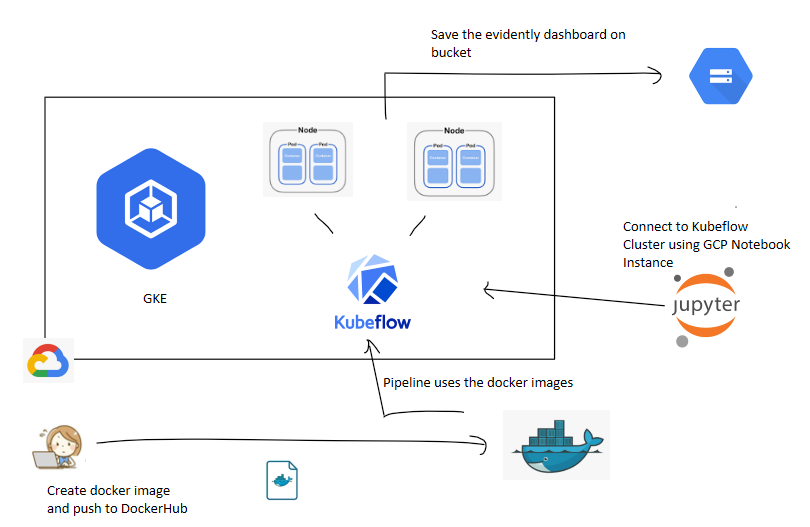

# Dphi-MLOps-Assignment
 
 ## Project Title: Implementing Kubeflow with Evidently.ai for Model Monitoring
 
Project Tasks:

| Task | Status |
| ------- | ------ |
| 1. Install and configure Kubeflow on a Kubernetes cluster | Completed ✔️ |
| 2. Install and configure Evidently.ai on the same cluster | Completed ✔️ |
| 3. Write a Python script to train a model on a dataset | Completed ✔️ |
| 4. Use Kubeflow to create a pipeline to train & track model with Evidently.ai | Completed ✔️ |

## MLOps pipeline

### Architecture




### Deployment

The MLOps pipeline can be easily deployed via the following steps:

1. Clone the `dphi-mlops-assignment` repository locally:

    ```bash
    $ git clone https://github.com/verma-kartik/dphi-mlops-assignment.git
    ```
    
2. Goto folder `download_data`, build and push the docker image to your own registry. Repeat the step for folder `extremegboost`

    ```bash
    $ docker build -t <username>/<nameOfDockerImage> .
    $ docker push <username>/<nameOfDockerImage>
    ```
    
3. Now, before moving on, create your infrastructure on Google Cloud Platform (GCP).

   a. Log in to your console. Create a new GCP project named <PROJECT_NAME>.
   
   b. Search `Kubeflow Pipelines` in GCP Marketplace and click `Configure`. Select your configurations and click `Deploy`. Wait till the custer is being deployed.
   
   c. Search `AI Platform` in GCP Marketplace. Goto `Pipleines > Open Pipelines Dashboard`. Your Kubeflow Pipelines UI will open.
   
   d. On `AI Marketplace`, goto `Workbench > New Notebook > Create` to deploy your custom Jupyter Notebook instance.
   
   e. Create a Service Account from `IAM` and download your access credentials file.
   

4. Goto `evidently_monitoring/evidently_monitoring.py` and,

   a. Line 71, replace `<path_to_JSON_file>` with the path to your GCP service account credentials location.
   
   b. Line 73, replace the `<BUCKET_NAME` in `bucket = client.get_bucket(<...>)` with the bucket associated with your notebook instance.
   
   c. Repeat Step 2.
   
5. Change the value of `image:` tag in `download_data.yaml`, `extremegboost.yaml` and `evidently_monitoring.yaml` with `docker.io/<USERNAME>/<IMAGE_NAME>:<TAG>` as you ceated in Step 2 and Step 4.c respectively.
   
6. Open your notebook instance and create a new .ipynb file.

   a. Copy the content of file `pipeline.py` onto the cell. Replace `<public-link-to-Kubeflow-pipeline>` in `client = kfp.Client(<...>)` with the public address of your Kubeflow Pipleines dashboard. Copy it from the URL browser, format `[a-Z][0-9][-].pipelines.googleusercontent.com`.
   
   b. Upload the `download_data.yaml`, `extremegboost.yaml` and `evidently_monitoring.yaml` manifests to the local storage of the notebook instance.
   
   c. Run the cell. Click on `Run Details` to open pipeline executing in Kubeflow.
   
   

